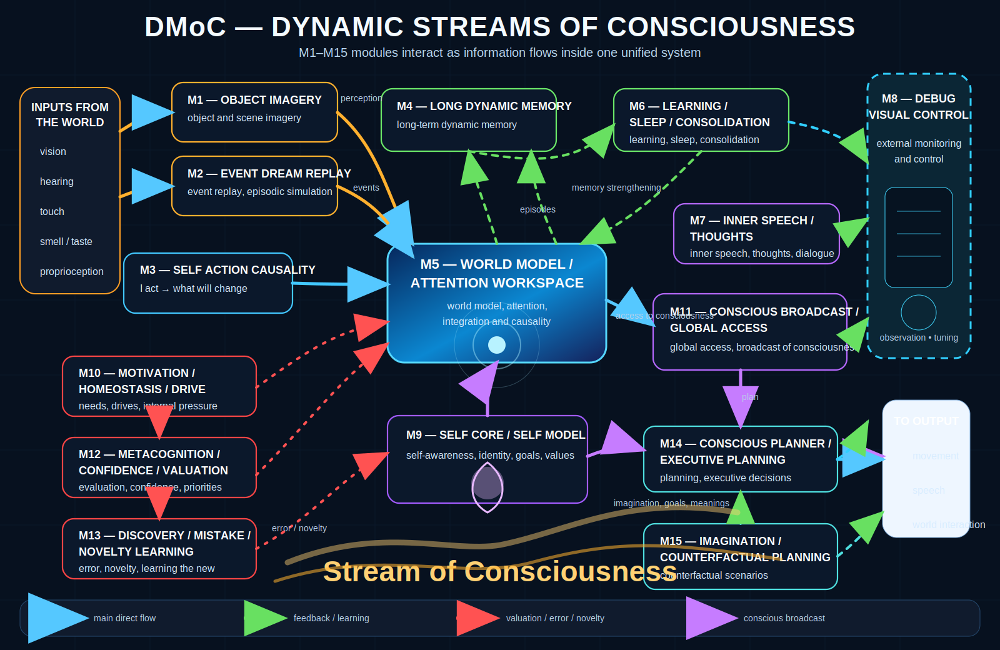

# Digital Model of Consciousness

> Experimental embodied world-model system with MuJoCo life loop, multi-modal sensors, object-slot memory, inner imagery, sleep/dream modes, self-state, debug tools, and modular M1-M15 architecture.

This project treats consciousness not as one isolated algorithm, but as a time-unfolding system: body, sensors, actions, memory, an internal world model, object representations, sleep and dream states, self-observation, attention control, motivation, metacognition, and inner narration.

The practical goal of the current version is to make internal processes visible and controllable: to observe what the world model is learning, which object slots are forming, when memory contains a dynamic object image, which modules are training or frozen, and how the agent behaves in wake/sleep/dream modes.

---

## Dynamic streams of consciousness



---

## Current focus

The current development focus is the modular architecture for a digital model of consciousness:

```text
M1  Object imagery
M2  Event and dream replay
M3  Self/action causality
M4  Long dynamic memory
M5  World model / attention / workspace
M6  Learning / sleep / consolidation
M7  Inner speech / thoughts
M8  Debug / visual / control
M9  Self core
M10 Global conscious broadcast
M11 Motivational homeostasis
M12 Metacognition monitor
M13 Autobiographical memory
M14 Semantic grounding
M15 Counterfactual imagination / planning
```

---

## Capabilities

- MuJoCo embodied life loop.
- Stereo RGB/depth sensing.
- Contact/tactile sensing.
- IMU/vestibular/body-state input.
- Dreamer-style world model.
- Multi-slot latent object imagery.
- Inner object decoding and 3D visualization.
- Sleep and dream sensor-gating modes.
- SelfCore / agency / self-state runtime.
- Debug module schematic and IPC control.
- Manual action override and action trace diagnostics.

---

## Runtime states

| State | Meaning |
|---|---|
| `AWAKE` | Sensors are active and the system runs the normal life loop. |
| `BLIND` | Video is disabled, but other sensors may still be active. |
| `PARTIAL SENSOR CUT` | Some sensors are disabled, but the agent is not fully asleep. |
| `DREAMER-DECODING` | All sensors are off and a stable internal slot is being decoded. |
| `DREAM-EMPTY` | All sensors are off, but there is no stable slot to decode. |

Full sleep is defined as:

```python
not video_sensor_enabled and not contact_sensor_enabled and not imu_sensor_enabled
```

---

## Repository structure

The project is now organized around application orchestration, architecture modules, platform infrastructure, and shared utilities.

```text
Digital-Model-of-Consciousness/
├── runner.py                         # root compatibility launcher
├── config/
│   └── runner.yaml                   # main Hydra config
├── docs/
│   ├── architecture/
│   └── images/
├── src/
│   ├── apps/
│   │   ├── runner.py                 # main V5.10 orchestration entrypoint
│   │   ├── life_runtime.py
│   │   ├── unified_conscious_viewer.py
│   │   ├── bootstrap.py              # future extraction boundary
│   │   ├── runtime_wiring.py         # future cross-module wiring boundary
│   │   └── system_factory.py         # future system factory boundary
│   │
│   ├── modules/
│   │   ├── m01_object_imagery/
│   │   ├── m02_event_dream_replay/
│   │   ├── m03_self_action_causality/
│   │   ├── m04_long_dynamic_memory/
│   │   ├── m05_world_model_attention_workspace/
│   │   ├── m06_learning_sleep_consolidation/
│   │   ├── m07_inner_speech_thoughts/
│   │   ├── m08_debug_visual_control/
│   │   ├── m09_self_core/
│   │   ├── m10_global_conscious_broadcast/
│   │   ├── m11_motivational_homeostasis/
│   │   ├── m12_metacognition_monitor/
│   │   ├── m13_autobiographical_memory/
│   │   ├── m14_semantic_grounding/
│   │   └── m15_counterfactual_imagination_planning/
│   │
│   ├── platform/
│   │   ├── mujoco_world/
│   │   ├── ipc/
│   │   ├── gui/
│   │   └── scene_builder/
│   │
│   └── shared/
│       ├── config.py
│       ├── checkpointing.py
│       └── console_colors.py
```

For the detailed current structure, see:

```text
docs/architecture/current_structure.md
```

---

## Layer rules

### `runner.py`

The root runner is a thin compatibility launcher. It normalizes config paths, sets `PROJECT_ROOT`, and delegates to `src/apps/runner.py`.

### `src/apps/`

Application orchestration. This layer may import from many modules and is allowed to wire the full system together.

### `src/modules/`

Architecture-level consciousness modules. Each M-module should own its own state, runtime, models, memory, debug helpers, and module-specific visualization.

### `src/platform/`

Infrastructure that is not a consciousness module: MuJoCo world, low-level IPC transport, GUI support, scene builders, and simulator adapters.

### `src/shared/`

Common config dataclasses, checkpointing, event bus, schemas, common types, and utilities.

---

## Running

Typical Hydra-style run:

```bash
python runner.py --config-path config --config-name runner
```

Headless-style run example:

```bash
python runner.py --config-path config --config-name runner \
  viewer.allow_mujoco_window=false \
  inner_world.enabled=false
```

Enable train mode from CLI:

```bash
python runner.py --config-path config --config-name runner mode=train train.enabled=true
```

---

## Configuration

Main config:

```text
config/runner.yaml
```

Module-specific config fragments may live inside module folders, for example:

```text
src/modules/m02_event_dream_replay/config/
src/modules/m03_self_action_causality/config/
src/modules/m08_debug_visual_control/config/
src/modules/m15_counterfactual_imagination_planning/config/
```

---

## Generated runtime data

The following directories are runtime artifacts and should normally not be committed:

```text
checkpoints/
data/
runs/
logs/
artifacts/
outputs/
inner_world_frames/
open3d_exports/
```

---

## Architecture documentation

```text
docs/architecture/current_structure.md
docs/architecture/module_file_map.md
docs/architecture/module_file_map.json
docs/architecture/module_migration_plan.md
```

---

## Current architecture caution

`M1_OBJECT_IMAGERY` is currently a strong integration point and imports several cross-module mixins. This is acceptable during migration, but the target direction is to move cross-module composition into `src/apps/runtime_wiring.py` and keep each M-module focused on its own semantic responsibility.

---

## Notes

This is a fast-moving experimental research prototype. APIs, file names, and module boundaries may change often. The current direction prioritizes:

- clear M1-M15 module boundaries;
- live inspection of latent state;
- object memory stability;
- sleep/dream correctness;
- explicit self-state and agency modeling;
- runtime controllability from an external panel;
- safe refactoring with documentation and compatibility boundaries.
