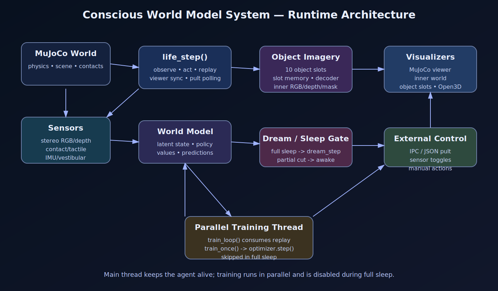
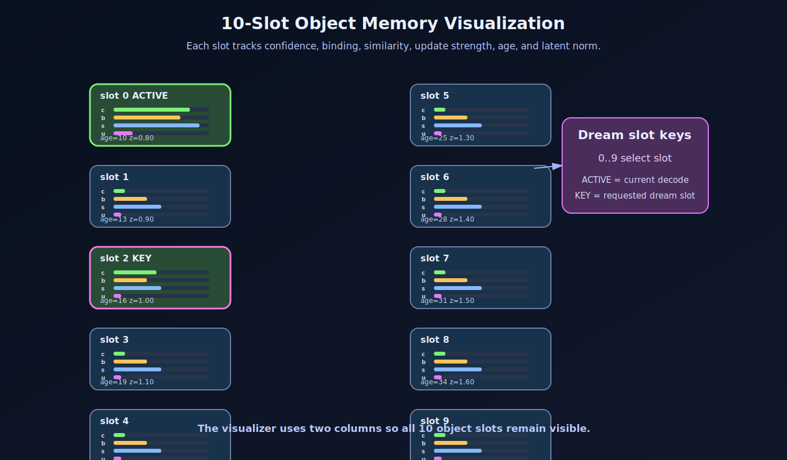
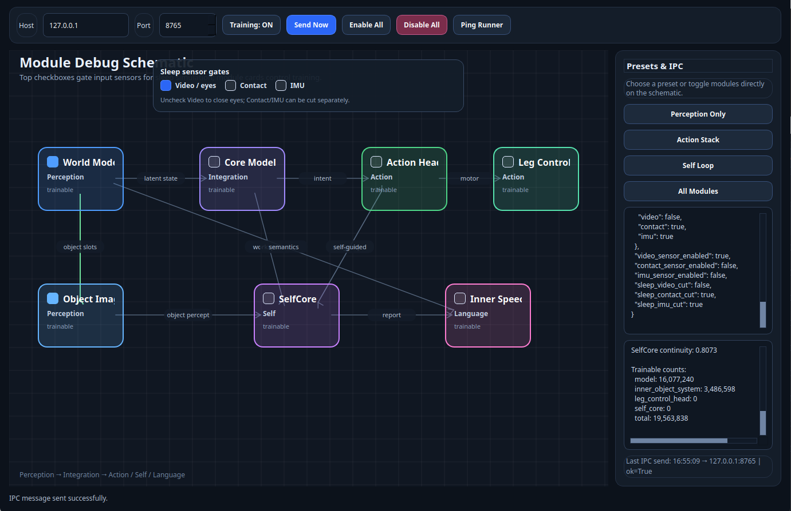
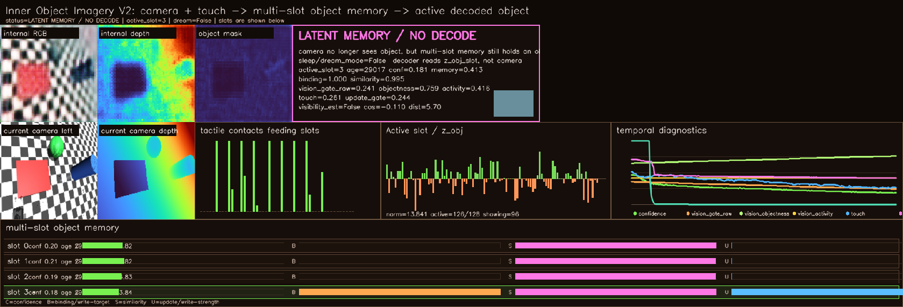
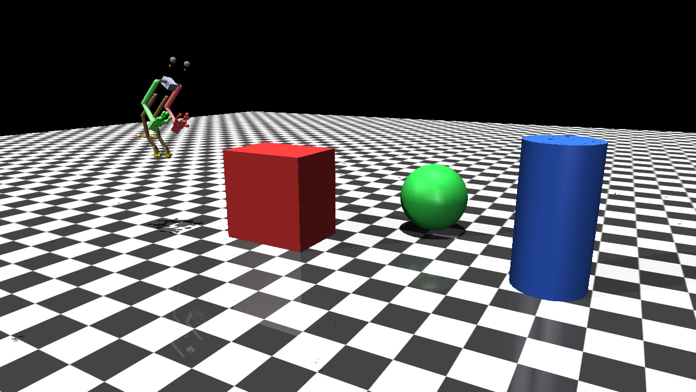
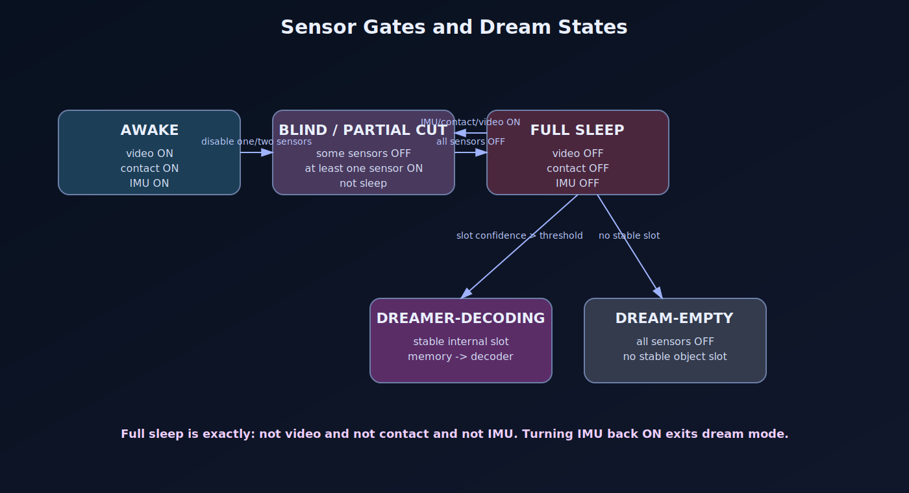

# Conscious World Model System

> **A model of conscious behavior in the latent space of a world model** is a research project aimed at one of humanity's highest aspirations: the pursuit of extended, durable life through the construction of a digital model of consciousness.

This project treats consciousness not as a single isolated algorithm, but as a time-unfolding system: body, sensors, actions, memory, an internal world model, object representations, sleep and dream states, self-observation, and attention control. The central idea is to create a digital agent that does not merely recognize images or execute commands, but lives inside a simulated environment, accumulates experience, forms internal images of objects, tests its expectations through action, and gradually builds a stable model of its own presence in the world.

In the long term, the project is intended as a research platform for studying how a digital form of subjectivity may emerge through a continuous loop of perception, action, memory, inner replay, and adaptation. The practical goal of the current version is to make internal processes visible and controllable: to observe what the world model is learning, which object slots are forming, when memory truly contains a dynamic object image, and which modules are currently training or frozen.


> Experimental embodied world-model system with MuJoCo life loop, multi-modal sensors, object-slot memory, inner imagery, dream/sleep modes, and live visualization tools.

**Language:** [English](#english)

---

## English

### Overview

**Conscious World Model System** is an experimental research prototype for building an embodied agent that lives inside a MuJoCo world, receives multi-modal sensory input, forms internal object representations, and visualizes its own latent state.

The project combines:

- a MuJoCo embodied environment;
- stereo camera/depth input;
- tactile/contact sensors;
- IMU/vestibular input;
- neural world-model components;
- object-slot latent memory;
- inner object decoding and 3D imagery;
- sleep/dream sensor-gating modes;
- live debugging and visualization windows;
- IPC/JSON control from an external control panel.

The goal is not only to train a policy, but to inspect how internal representations appear, persist, disappear, and become available for inner replay or dream-like decoding.


<p align="center">
  
</p>

---

### Current focus

The current development branch is focused on **latent object representation**:


<p align="center">
  
</p>

- how object slots are formed;
- how slots remain bound to objects;
- how internal object memory behaves when sensors are disabled;
- how dream decoding differs from live sensory decoding;
- how to visualize all object slots and their confidence/binding/similarity/update values.

Recent runtime states include:

| State | Meaning |
|---|---|
| `AWAKE` | Sensors are active and the system runs the normal life loop. |
| `BLIND` | Video is disabled, but other sensors may still be active. |
| `PARTIAL SENSOR CUT` | Some sensors are disabled, but the agent is not fully asleep. |
| `DREAMER-DECODING` | All sensors are off and a stable internal slot is being decoded. |
| `DREAM-EMPTY` | All sensors are off, but there is no stable slot to decode. |

Full sleep is defined as:

```python
not video_sensor_enabled and not contact_sensor_enabled and not imu_sensor_enabled
```

If at least one sensor is enabled again, for example IMU, the system exits full sleep.

---

### Main capabilities


### Runtime screenshots

These screenshots show the current live runtime tools.

<p align="center">
  
</p>

**Module Debug Schematic / IPC control panel** — a live control surface for module training flags, sensor gates, presets, and runtime IPC messages.

<p align="center">
  
</p>

**Inner Object Imagery V2** — internal RGB/depth/mask decoding, active object slot diagnostics, temporal signals, and multi-slot object memory.

<p align="center">
  
</p>

**MuJoCo embodied scene** — the agent body, stereo rig, manipulators, and simple object world used for embodied sensing and control.

---


#### 1. Embodied MuJoCo life loop

The agent runs continuously inside a MuJoCo world. The life loop is responsible for:

- observing the world;
- updating model state;
- applying actions;
- updating visualizers;
- writing replay samples;
- polling external control commands;
- opening/closing the MuJoCo viewer from runtime flags.

`life_step()` is the central life update and always remains the owner of MuJoCo viewer runtime toggling.

#### 2. Parallel training loop

Training is designed to run in a **parallel background thread**.

Architecture:

```text
main thread:
  system.run()
    -> life_step()
       -> MuJoCo viewer
       -> visualizers
       -> replay.add()

background thread:
  train_loop()
    -> train_once()
       -> optimizer.step()
```

During full sleep, training is disabled:

```text
video OFF + contact OFF + imu OFF
-> sleep_mode_training_disabled
-> no optimizer step
```

#### 3. Multi-slot object memory

The system uses a multi-slot latent object memory. Current default:

```yaml
object_image:
  num_slots: 10
  max_object_proposals: 10
```

Each slot can be visualized with:

- confidence;
- binding;
- similarity;
- update strength;
- age;
- latent norm.

The inner object visualizer draws all 10 slots in a compact two-column layout.

#### 4. Inner object imagery

The object imagery module decodes latent object slots into internal visual representations:

- RGB-like internal image;
- depth-like internal map;
- mask/object alpha;
- 3D point/voxel-style representation.

This is used to inspect whether the model is only copying the current camera input or actually holding a persistent internal object representation.

#### 5. Sleep and dream modes

Sleep/dream behavior is controlled by sensor gates:


<p align="center">
  
</p>

```text
video OFF + contact OFF + imu OFF -> full sleep
video OFF only                    -> blind awake mode
video OFF + contact OFF + imu ON  -> partial sensor cut, not sleep
```

Dream decoding has two modes:

```text
DREAMER-DECODING
  internal slot exists and is decoded

DREAM-EMPTY
  all sensors are off, but no stable slot exists yet
```

In dream mode, object slots can be selected manually from the inner object visualizer window using keys:

```text
0 1 2 3 4 5 6 7 8 9
```

#### 6. External control panel / IPC

The system supports runtime control through JSON/IPC commands. Typical controls include:

- enable/disable MuJoCo viewer;
- show/hide camera preview;
- show/hide inner world visualizer;
- show/hide object imagery visualizer;
- toggle object Open3D viewer;
- enable/disable training;
- disable video/contact/IMU sensors;
- send manual action overrides.

MuJoCo viewer can be toggled with compatible keys:

```text
mujoco_next_run
mujoco
mujoco_viewer
```

---

### Project structure

The runner has been refactored into an orchestration-style structure:

```text
runner.py
runtime_v5_10/
  config.py
  life_runtime.py
  training_runtime.py
  sleep_sensors.py
  external_control.py
  ipc_runtime.py
  action_runtime.py
  object_imagery_runtime.py
  inner_visual_runtime.py
  camera_preview_window.py
  action_outputs_window.py
  checkpointing.py
  module_status_runtime.py
  leg_bird_runtime.py
  self_core_runtime.py
models/
  object_inner_imagery_3d.py
visualizer/
  inner_object_visualizer.py
```

High-level responsibilities:

| File | Responsibility |
|---|---|
| `runner.py` | Main entry point and orchestration. |
| `runtime_v5_10/life_runtime.py` | Life loop, MuJoCo viewer sync, replay writing. |
| `runtime_v5_10/training_runtime.py` | Parallel train loop and train step logic. |
| `runtime_v5_10/sleep_sensors.py` | Sensor-gating and full-sleep detection. |
| `runtime_v5_10/object_imagery_runtime.py` | Runtime bridge for inner object imagery. |
| `models/object_inner_imagery_3d.py` | Multi-slot latent object memory and decoder. |
| `visualizer/inner_object_visualizer.py` | 10-slot inner object visualization window. |

---

### Configuration example

Example `runner.yaml` fragments:

```yaml
mode: train

train:
  enabled: true
  lr: 0.00015
  weight_decay: 0.00001
  gradient_clip: 5.0
  train_sleep_sec: 0.01

object_image:
  enabled: true
  width: 1520
  height: 1260
  num_slots: 10
  max_object_proposals: 10
  dream_latent_dynamics: true
  dream_strength: 0.025
  dream_cycle_slots: false
  dream_slot_cycle_steps: 90
  dream_empty_confidence_threshold: 0.05

object_image_open3d:
  enabled: true
  max_slots: 10
```

Important distinction:

```yaml
mode: train

train:
  enabled: true
```

`mode: train` is top-level. Do not put `mode: train` inside the `train:` block.

---

### Running

Typical Hydra-style run:

```bash
python runner.py --config-path config --config-name runner
```

Headless-style run example:

```bash
python runner.py --config-path config --config-name runner \
  viewer.allow_mujoco_window=false \
  inner_world.enabled=false
```

Enable train mode from CLI:

```bash
python runner.py --config-path config --config-name runner mode=train train.enabled=true
```

---

### Notes

This project is a fast-moving experimental prototype. APIs, file names, and module boundaries may change often. The current direction prioritizes:

- clear separation between life loop and training loop;
- live inspection of latent states;
- object memory stability;
- sleep/dream mode correctness;
- runtime controllability from an external panel.

---