# DOT graph format — fixed project standard

This file fixes the DOT format used for DMoC architecture diagrams.

## Main rule

All `.dot` architecture graphs must use the **top-level edge format**:

1. `subgraph cluster_*` contains **only nodes**.
2. All `node -> node` edges are written at the **top level** of the file.
3. Do not put edges inside clusters.
4. Do not use `ltail` / `lhead` / `compound=true` for normal architecture graphs.
5. Every edge must be explicit and visible.
6. Every statement ends with `;`.
7. Use short visible `label`.
8. Put long explanations into `description`.
9. NN nodes must:
   - have visible label starting with `NN:`
   - use light-red background: `fillcolor="#ffd6d6"`

## Why

Some editors render nodes inside clusters correctly but hide or lose edges placed
inside `subgraph cluster_*`. Graphviz itself may render them, but the editor view
can look disconnected.

Therefore, all groups contain nodes only, and all connections are declared at the
top level.

## Required graph header

Use this pattern:

```dot
digraph G {
  graph [
    layout=dot,
    rankdir=TB,
    compound=false,
    splines=polyline,
    overlap=false,
    concentrate=false,
    bgcolor="#f7f8fb",
    outputorder=edgesfirst,
    fontname="Arial",
    labelloc="t",
    label="..."
  ];

  node [
    shape="box",
    style="filled,rounded",
    fontname="Arial",
    fontsize="10",
    penwidth="2.0",
    margin="0.11,0.075",
    color="#27364a",
    fillcolor="#ffffff"
  ];

  edge [
    fontname="Arial",
    fontsize="9",
    penwidth="3.2",
    arrowsize="0.95",
    color="#1f2a38"
  ];

  subgraph cluster_module {
    label="Module";
    color="#255c99";
    fillcolor="#e8f1ff";
    style="filled,rounded";
    penwidth="2.0";

    node_a [
      label="Node A",
      description="Long Russian description here.",
      fillcolor="#ffffff"
    ];

    node_b_nn [
      label="NN: Node B",
      description="Neural module description.",
      color="#bb3333",
      fillcolor="#ffd6d6"
    ];
  }

  // All edges are outside clusters.
  node_a -> node_b_nn [
    label="visible edge",
    color="#255c99"
  ];
}
```



## Forbidden pattern

Do not put edges inside `subgraph cluster_*`:

```dot
subgraph cluster_m1 {
  a [label="A"];
  b [label="B"];

  // Forbidden: edge inside cluster.
  a -> b;
}
```

## NN visual convention

NN nodes must look like this:

```dot
m1_fusion_nn [
  label="NN: VisualTactileObjectFusion",
  description="...",
  color="#bb3333",
  fillcolor="#ffd6d6"
];
```

## Description convention

Visible `label` stays short:

```dot
label="M5 workspace"
```

Detailed meaning goes into `description`:

```dot
description="World model / attention workspace.\n\nReceives semantic M1 summary and seed through boundary."
```

## File naming

Stable graph files live in:

```text
docs/architecture/graphs/
```

Use names like:

```text
unconscious_contour_architecture.dot
unconscious_contour_runtime_life_step.dot
module_m1_object_imagery.dot
module_m2_event_dream_replay.dot
module_m4_long_dynamic_memory.dot
module_m5_seed_bus.dot
```

Avoid:

```text
new.dot
final.dot
test2.dot
```

## Maintenance rule

If a graph already exists, refine the existing `.dot` file instead of creating
a competing version.
